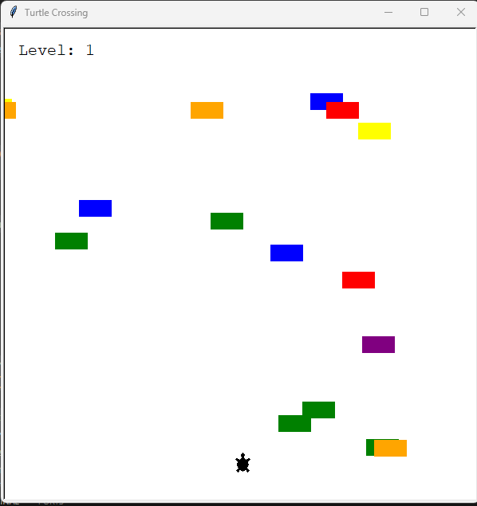

# 🐢 Turtle Crossing - Learn OOP in Python by Building a Game

Welcome to **Turtle Crossing**, a beginner-friendly game built with Python's built-in `turtle` graphics library. This project is designed as an **educational guide** to teach you how to use:

- Python **classes** and **functions**
- Basic **object-oriented programming (OOP)**
- Real-time game logic with graphics

---

## 🎯 Project Goal

The main goal of this project is to **teach you OOP in Python step-by-step** through a fun game where the player (a turtle) tries to cross a road full of cars.

---
## 🎮 How to Play
Press the Up Arrow to move your turtle.

Cross the road without getting hit by cars.

Reach the top to go to the next level (cars get faster).

If you collide with a car — Game Over!

## ✅ What You Will Learn
How to use **classes** and inheritance

How to break up a project into multiple files

How to create interactive games with turtle

How to use **loops, conditionals**, and randomization in game logic

## 🧰 Requirements

- Python 3.7 or later
- No external packages — the `turtle` module is included with Python

---

# 📚 Full Code Walkthrough with Explanations
## 🧠 main.py - The Game Controller

These lines import the modules and classes needed to build the game.
```python
from turtle import Screen  # Imports the graphics screen from turtle
import time                # Used to pause the game loop
from player import Player  # Imports the Player class from player.py
from car_manager import CarManager  # Imports CarManager class
from scoreboard import Scoreboard   # Imports Scoreboard class 
```
We set up the game screen and prepare it to listen for key presses.

```python
screen = Screen()
screen.title("Turtle Crossing")          # Sets window title
screen.setup(width=600, height=600)      # Creates a 600x600 window
screen.tracer(0)                         # Turns off auto-updates for smoother animation
screen.listen()                          # Enables keyboard input
```

We instantiate our main game objects.

```python
player = Player()                # Create a player object (turtle)
car_manager = CarManager()       # Create a car manager (spawns/moves cars)
scoreboard = Scoreboard()        # Create a scoreboard (tracks level)
```
This binds the up arrow key to move the turtle forward.

```python
screen.onkey(player.move_up, "Up")  # When "Up" is pressed, call move_up()
```
This loop is the core game loop. It:
Slows the game using time.sleep
Updates the screen manually
Creates and moves cars
Checks for collision with any car — if a crash happens, the game ends.
```python
game_is_on = True
while game_is_on:
    time.sleep(0.1)      # Delay to control game speed
    screen.update()      # Manually update the screen (since tracer(0) was set)

    car_manager.create_car()  # Possibly create a new car
    car_manager.move_cars()   # Move all cars left

    for car in car_manager.all_cars:
        if player.distance(car) < 20:
            scoreboard.game_over()
            game_is_on = False
```
If the player reaches the finish line:
Reset their position
Make the cars faster
Increase the level
```python
    if player.ycor() > 280:  # If player reached top
        player.reset_position()
        car_manager.level_up()
        scoreboard.level_up()
```
```python
screen.exitonclick()  # Wait for user to click to close the window
```

## 🐢 player.py - The Player Character
Define constants: start location, movement step, and finish line.
```python
from turtle import Turtle
STARTING_POSITION = (0, -280)
MOVE_DISTANCE = 10
FINISH_LINE_Y = 280
```
Start the Player class that inherits from Turtle.
```python
class Player(Turtle):
    """Handles the turtle character controlled by the player."""
```
Sets up the turtle’s appearance and position.
```python
    def __init__(self):
        super().__init__()          # Initialize Turtle
        self.shape("turtle")        # Use turtle shape
        self.penup()                # Don’t draw lines
        self.go_to_start()          # Move to starting point
        self.setheading(90)         # Point turtle upwards
```
Moves the turtle forward (upward).
```python
    def move_up(self):
        """Moves the player up by MOVE_DISTANCE."""
        self.forward(MOVE_DISTANCE)
```
These functions reset the turtle to the bottom of the screen.
```python
    def go_to_start(self):
        self.goto(STARTING_POSITION)

    def reset_position(self):
        """Resets player to the starting position."""
        self.go_to_start()
```
## 🚗 car_manager.py - Spawning and Moving Cars
Sets up color options and speed settings.
```python
from turtle import Turtle
import random
COLORS = ["red", "orange", "yellow", "green", "blue", "purple"]
STARTING_MOVE_DISTANCE = 5
MOVE_INCREMENT = 10
```
Starts the class. It doesn’t inherit from Turtle — instead, it manages many turtles (cars).
```python
class CarManager:
    """Creates and moves cars in the game."""
```
Keeps track of all cars in a list and their speed.
```python
    def __init__(self):
        self.all_cars = []
        self.car_speed = STARTING_MOVE_DISTANCE
```

Randomly creates a car with a random color and Y-position, and adds it to the list.
```python
    def create_car(self):
        if random.randint(1, 6) == 1:  # Roughly 1 out of every 6 frames
            new_car = Turtle("square")
            new_car.color(random.choice(COLORS))
            new_car.penup()
            new_car.shapesize(stretch_wid=1, stretch_len=2)
            new_car.goto(300, random.randint(-250, 250))
            self.all_cars.append(new_car)
```
Moves each car to the left.
```python
    def move_cars(self):
        for car in self.all_cars:
            car.backward(self.car_speed)
```
Increases car speed with each level.
```python

    def level_up(self):
        self.car_speed += MOVE_INCREMENT
   ```
## 🧾 scoreboard.py - Displaying the Level and Game Over
Set up display font.
```python
from turtle import Turtle
FONT = ("Courier", 15, "normal")
```
Create a class that inherits from Turtle to draw text.
```python
class Scoreboard(Turtle):
    """Displays the level and game over message."""
```
Set up the scoreboard’s position and initial display.
```python
    def __init__(self):
        super().__init__()
        self.level = 1
        self.penup()
        self.hideturtle()
        self.color("black")
        self.goto(-280, 260)
        self.update_scoreboard()
```
Draws the current level on screen.
```python
    def update_scoreboard(self):
        self.clear()
        self.write(f"Level: {self.level}", font=FONT)
```
Increments level and updates display.
```python
    def level_up(self):
        self.level += 1
        self.update_scoreboard()
```
Displays a Game Over message in the center.
```python
    def game_over(self):
        self.goto(0, 0)
        self.write("Game Over", align="center", font=FONT)
```
